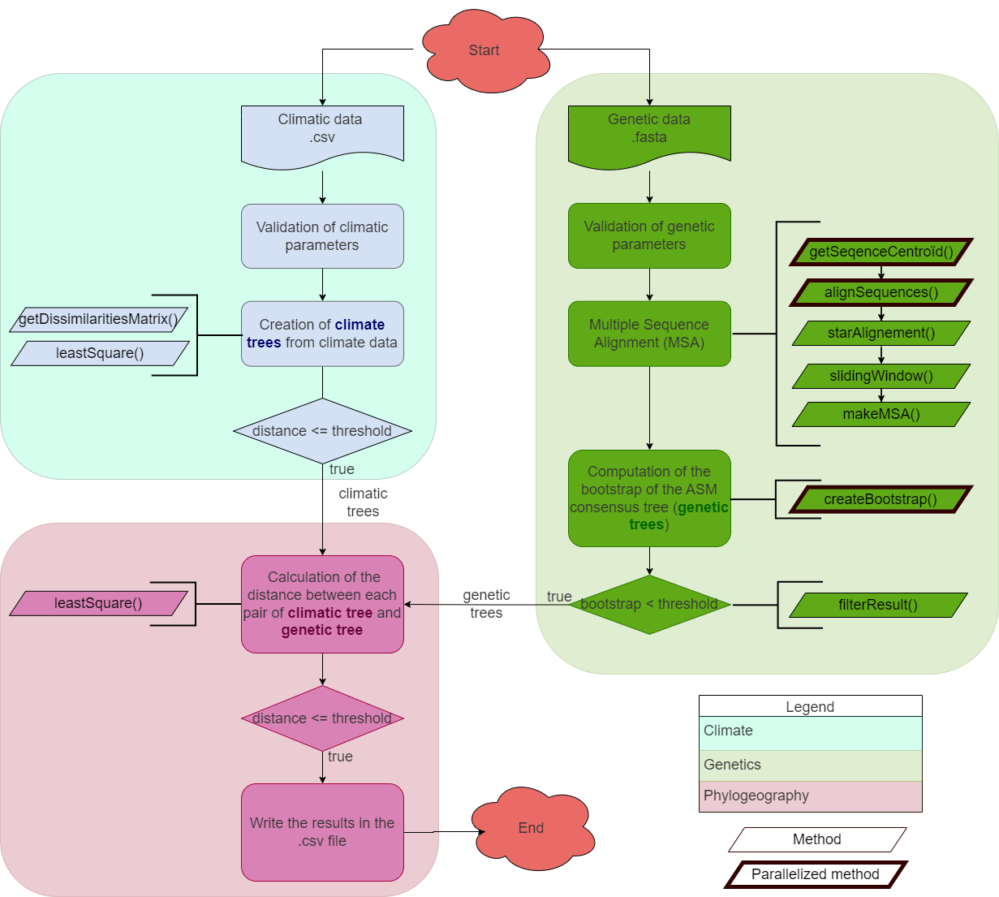

<h1  align="center"> aPhyloGeo <p align='center'> 
        [](https://opensource.org/licenses/MIT) 
        [](https://pysd.readthedocs.io/en/latest/development/development_index.html)
        [](https://pypi.python.org/pypi/pysd/)
        [](https://hits.seeyoufarm.com)
        [](https://github.com/tahiri-lab/aPhylogeo/releases/)
        </p>


<h2  align="center">Multi-platform application for analyze phylogenetic trees with climatic parameters</h2>

<details open>
  <summary>Table of Contents</summary>
  <ol>
    <li>
      <a href="#about-the-project">About the project</a>
    </li>
    <li>
      <a href="#Installation">Installation</a>
      <ul>
        <li><a href="#Linux-UNIX-and-Mac-OS-versions">Linux/UNIX and Mac OS versions</a></li>
      </ul>
    </li>
    <!--<li> Available analyses</li>
      <ul>
        <li><a href="#Group-creation">Group creation</a></li>
        <li><a href="#SimPlot-analysis">SimPlot analysis</a></li>
        <li><a href="#Similarity-networks">Similarity networks</a></li>
        <li><a href="#BootScan-analysis">BootScan analysis</a></li>
        <li><a href="#Findsites">Findsites</a></li>
        <li><a href="#Detection-of-recombination">Detection of recombination</a></li>
      </ul>-->
     <li>
      <a href="#Settings">Settings</a>
    </li>
    <li>
      <a href="#Example">Example</a>
      <ul>
        <li><a href="#Input">Input</a></li>
        <li><a href="#Output">Output</a></li>
      </ul>
    </li>
    <li>
      <a href="#References">References</a>
    </li>
    <li>
      <a href="#contact">Contact</a>
    </li>
  </ol>
</details>


# About the project

`aPhyloGeo` is a bioinformatics pipeline dedicated to the analysis of phylogeography. `aPhyloGeo` is an open-source multi-platform application designed by the team of Professor Nadia Tahiri (University of Sherbrooke, Quebec, Canada). It is implemented in Python. This tool can be used to obtain trees from climatic data of the regions where the samples have been collected. Those climatic trees are then used for topological and evolutionary comparison against phylogenetic trees from multiple sequence alignments (MSAs) using the [Least Square (LS) metric](https://www.sciencedirect.com/science/article/abs/pii/0025556481900432?via%3Dihub). MSAs that yield trees with a significant `RF` value are then saved in folders with their respective tree. The `output.csv` file contains the informations of all the significant MSAs informations.

## Workflow




The workflow of the algorithm. The operations within this workflow include several blocks. The blocks are highlighted by three different colors. The first block (the light pink color) is responsible for creating the trees based on the climate data. The second block (the dark yellow color) performs the function of input parameter validation. The third block (the light-yellow color) allows the creation of phylogenetic trees. This is the most important block and the basis of this study, through the results of which the user receives the output data with the necessary calculations.

**Multiprocessing**: Allows multiple windows to be analyzed simultaneously (recommended for large datasets)

In this work, we applied software packages of the following versions: MUSCLE version 3.18 (GNU GENERAL PUBLIC LICENSE), PHYLIP version 3.18 (open source license), RAxML version 8.2.12 (GNU GENERAL PUBLIC LICENSE).

[Biopython](https://biopython.org/)


# Installation

## Linux UNIX and Mac OS versions
aPhyloGeo is available as a Python script.

### Prerequisites
Before using this program, make sure that you have installed all the necessary libraries for it to work properly. To do this, simply type the following command:

```
pip3 install -r requirements.txt
```

### Python script
A `requirements.txt` file containing all required libraries is available in the GitHub repository.

Assuming Python 3.8 or higher is installed on the machine, the script should run well with the libraries installed.

<u>Here is an example of how to run the script in Linux/UNIX or Mac OS:</u>
1. After downloading the source code, go to the folder containing `main.py`.
2. If you do not have `virtualenv` installed, run `python3 -m pip install --user virtualenv`
3. Create a new virtual environment (venv) in your terminal using `python3 -m venv aPhyloGeo_env`.
4. Still in the terminal, enter the new venv using `source aPhyloGeo_env/bin/activate`.
5. Install the required libraries using `python3 -m pip install -r requirements.txt`.
6. Launch aPhyloGeo using `python3 main.py`.


# Settings
The `aPhyloGeo` software can be encapsulated in other applications and applied to other data by providing a YAML file. This file will include a set of parameters for easy handling.

- **Bootstrap threshold**: Number of replicates threshold to be generated for each sub-MSA (each position of the sliding window)
- **Window length**: Size of the sliding window
- **Step**: Sliding window advancement step
- **Distance choice**: Least Square (LS) distance (version 1.0) will be extented to [Robinson-Foulds (RF) metric](https://www.sciencedirect.com/science/article/abs/pii/0025556481900432?via%3Dihub)
- **Least Square distance threshold**: LS distance threshold at which the results are most significant


# Example

## Description

## Input

## Output

# References


1. Sequence alignment tool : `MUSCLE`
+ [Edgar, R.C. (2004) MUSCLE: multiple sequence alignment with high accuracy and high throughput.Nucleic Acids Res. 32(5):1792-1797.](https://academic.oup.com/nar/article/32/5/1792/2380623)
doi:10.1093/nar/gkh340]
+ [Edgar, R.C. (2004) MUSCLE: a multiple sequence alignment method with reduced time and space complexity BMC Bioinformatics, (5) 113.](https://bmcbioinformatics.biomedcentral.com/articles/10.1186/1471-2105-5-113)
doi:10.1186/1471-2105-5-113

2. Phylip Package: `Seqboot`, `DNADist`, `Neighbor`, `Consense`
    [J. Felsenstein. 1989. PHYLIP - Phylogeny Inference Package (Version 3.2) . Cladistics. 5: 164-166.](https://evolution.genetics.washington.edu/phylip.html)

3. Calculation of distance between phylogenetic tree: `Robinson-Foulds metric`
    [Robinson, D.F. and Foulds, L.R., 1981. Comparison of phylogenetic trees. Mathematical biosciences, 53(1-2), pp.131-147.](https://www.sciencedirect.com/science/article/abs/pii/0025556481900432?via%3Dihub)

4. Phylogenetic analysis: `RAxML`
    [A. Stamatakis: "RAxML Version 8: A tool for Phylogenetic Analysis and Post-Analysis of Large Phylogenies". In Bioinformatics, 2014](https://academic.oup.com/bioinformatics/article/30/9/1312/238053?login=true)


# Contact
Please email us at : <Nadia.Tahiri@USherbrooke.ca> for any question or feedback.
