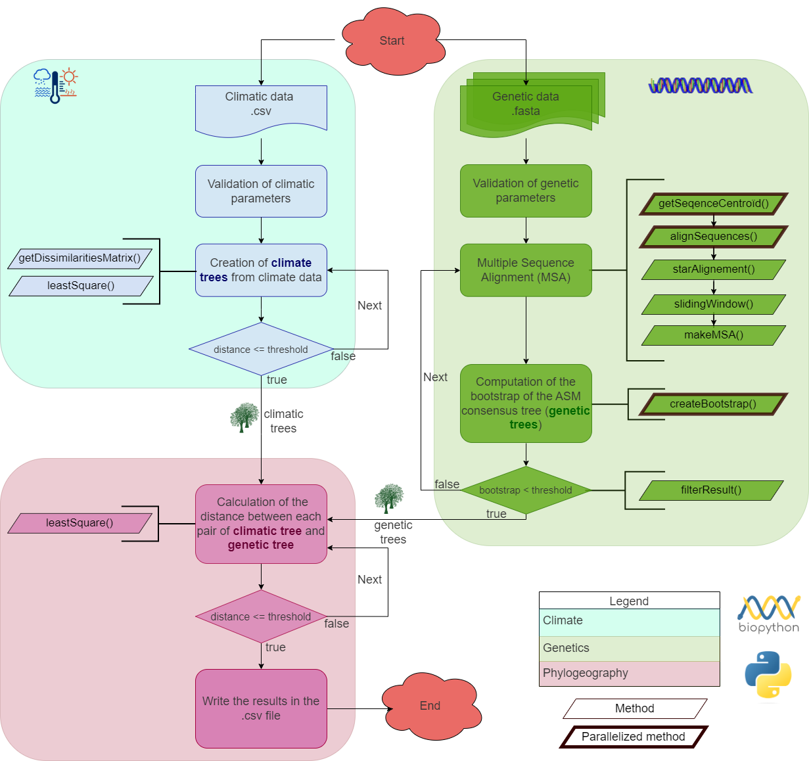

<h1  align="center"> aPhyloGeo <p align='center'> 
        [](https://opensource.org/licenses/MIT) 
        [](https://pysd.readthedocs.io/en/latest/development/development_index.html)
        [](https://pypi.python.org/pypi/pysd/)
        [](https://hits.seeyoufarm.com)
        [](https://github.com/tahiri-lab/aPhylogeo/releases/)
        </p>


<h2  align="center">Multi-platform application for analyze phylogenetic trees with climatic parameters</h2>

<details open>
  <summary>Table of Contents</summary>
  <ol>
    <li>
      <a href="#about-the-project">About the project</a>
    </li>
    <li>
      <a href="#Installation">Installation</a>
      <ul>
        <li><a href="#Linux-UNIX-and-Mac-OS-versions">Linux/UNIX and Mac OS versions</a></li>
      </ul>
    </li>
    <!--<li> Available analyses</li>
      <ul>
        <li><a href="#Group-creation">Group creation</a></li>
        <li><a href="#SimPlot-analysis">SimPlot analysis</a></li>
        <li><a href="#Similarity-networks">Similarity networks</a></li>
        <li><a href="#BootScan-analysis">BootScan analysis</a></li>
        <li><a href="#Findsites">Findsites</a></li>
        <li><a href="#Detection-of-recombination">Detection of recombination</a></li>
      </ul>-->
     <li>
      <a href="#Settings">Settings</a>
    </li>
    <li>
      <a href="#Example">Example</a>
      <ul>
        <li><a href="#Input">Input</a></li>
        <li><a href="#Output">Output</a></li>
      </ul>
    </li>
    <li>
      <a href="#References">References</a>
    </li>
    <li>
      <a href="#contact">Contact</a>
    </li>
  </ol>
</details>


# About the project

`aPhyloGeo` is a bioinformatics pipeline dedicated to the analysis of phylogeography. `aPhyloGeo` is an open-source multi-platform application designed by the team of Professor Nadia Tahiri (University of Sherbrooke, Quebec, Canada). It is implemented in Python. This tool can be used to obtain trees from climatic data of the regions where the samples have been collected. Those climatic trees are then used for topological and evolutionary comparison against phylogenetic trees from multiple sequence alignments (MSAs) using the [Least Square (LS) metric](https://www.ncbi.nlm.nih.gov/pmc/articles/PMC1706274/). MSAs that yield trees with a significant `LS` value are then optionnally saved in folders with their respective tree. The `output.csv` file contains the informations of all the significant MSAs informations (see Worflow Section for more details).

## Workflow




Figure 1. The workflow of the algorithm. The operations within this workflow include several blocks. The blocks are highlighted by three different colors. 
- **The first block** (the light blue color) is responsible for creating the trees based on the climate data - performs the function of input parameter validation (see YAML file). 
- **The second block** (the dark yellow color) is responsible for creating the trees based on the genetic data - performs the function of input parameter validation (see YAML file). 
- **The third block** (the light green color) allows the comparaison between the phylogenetic trees (i.e., with genetic data) and the climatic trees - denoted phylogeography step. 

This is the most important block and the basis of this study, through the results of which the user receives the output data with the necessary calculations.

Moreover, our approach is optimal since it is elastic and adapts to any computer by using parallelism and available GPUs/CPUs according to the resource usage per unit of computation (i.e., to realize the processing of a single genetic window - see the worflow below).
**Multiprocessing**: Allows multiple windows to be analyzed simultaneously (recommended for large datasets)

In this work, we applied software packages of the following versions: [Biopython](https://biopython.org/) version 1.79 (BSD 3-Clause License).


# Installation

## Linux UNIX and Mac OS versions
`aPhyloGeo` is available as a Python script.

### Prerequisites
Before using this program, make sure that you have installed all the necessary libraries for it to work properly. To do this, simply type the following command:

```
pip3 install -r requirements.txt
```

### Python script
A `requirements.txt` file containing all required libraries is available in the GitHub repository.

Assuming Python 3.8 or higher is installed on the machine, the script should run well with the libraries installed.

<u>Here is an example of how to run the script in Linux/UNIX or Mac OS:</u>
1. After downloading the source code, go to the folder containing `main.py`.
2. If you do not have `virtualenv` installed, run `python3 -m pip install --user virtualenv`
3. Create a new virtual environment (venv) in your terminal using `python3 -m venv aPhyloGeo_env`.
4. Still in the terminal, enter the new venv using `source aPhyloGeo_env/bin/activate`.
5. Install the required libraries using `python3 -m pip install -r requirements.txt`.
6. Launch aPhyloGeo using `python3 main.py`.


# Settings
The `aPhyloGeo` software can be encapsulated in other applications and applied to other data by providing a YAML file. This file will include a set of parameters for easy handling.

- **Bootstrap threshold**: Number of replicates threshold to be generated for each sub-MSA (each position of the sliding window)
- **Window length**: Size of the sliding window
- **Step**: Sliding window advancement step
- **Distance choice**: Least Square (LS) distance (version 1.0) will be extented to [Robinson-Foulds (RF) metric](https://www.sciencedirect.com/science/article/abs/pii/0025556481900432?via%3Dihub)
- **Least Square distance threshold**: LS distance threshold at which the results are most significant


# Example

## Description
We selected only 5 of 38 lineages with regional characteristics for further study (see Koshkarov et al., 2022). Based on location information, complete nucleotide sequencing data for these 5 lineages was collected from the [NCBI Virus website](https://www.ncbi.nlm.nih.gov/labs/virus/vssi/#/). In the case of the availability of multiple sequencing results for the same lineage in the same country, we selected the sequence whose collection date was closest to the earliest date presented. If there are several sequencing results for the same country on the same date, the sequence with the least number of ambiguous characters (N per
nucleotide) is selected. 

Although the selection of samples was based on the phylogenetic cluster of lineage and transmission, most of the sites involved represent different meteorological conditions. As shown in Figure 2, the 5 samples involved temperatures ranging from -4 C to 32.6 C, with an average temperature of 15.3 C. The Specific humidity
ranged from 2.9 g/kg to 19.2 g/kg with an average of 8.3 g/kg. The variability of Wind speed and All sky surface shortwave downward irradiance was relatively small across samples compared to other parameters. The Wind speed ranged from 0.7 m/s to 9.3 m/s with an average of 4.0 m/s, and All sky surface shortwave downward irradiance ranged from 0.8 kW-hr/m2/day to 8.6 kW-hr/m2/day with an average of 4.5 kW-hr/m2/day. In contrast to the other parameters, 75% of the cities involved receive less than 2.2 mm of precipitation per day, and only 5 cities have more than 5 mm of precipitation per day. The minimum precipitation is 0 mm/day, the maximum precipitation is 12 mm/day, and the average value is 2.1 mm/day.


## Input

The algorithm takes two files as input with the following definitions:

- **Genetic file** with fasta extebsion. The first file or set of files will contain the genetic sequence information of the species sets selected for the study. The name of the file must allow to know the name of the gene. It is therefore strongly recommended to follow the following nomenclature gene_name.fasta.
- **Claimatic file** with csv extebsion. The second file will contain the habitat information for the species sets selected for the study. Each row will represent the species identifier and each column will represent a climate condition.

## Output
The algorithm will return a csv file that contains information from all relevant MSAs (see Worflow Section for more details). The sliding windows of interest are those with interesting bootstrap support (i.e., indicating the robustness of the tree) and high similarity to the climate condition in question (i.e., based on the `LS` value). They will indicate, among other things, the name of the gene, the position of the beginning and end of the sliding window, the average boostratp value, the LS value and finally the climatic condition for which this genetic zone would explain the adaptation of the species in a given environment.


# References


1. Sequence alignment tool : `MUSCLE`
+ [Edgar, R.C. (2004) MUSCLE: multiple sequence alignment with high accuracy and high throughput.Nucleic Acids Res. 32(5):1792-1797.](https://academic.oup.com/nar/article/32/5/1792/2380623)
doi:10.1093/nar/gkh340]
+ [Edgar, R.C. (2004) MUSCLE: a multiple sequence alignment method with reduced time and space complexity BMC Bioinformatics, (5) 113.](https://bmcbioinformatics.biomedcentral.com/articles/10.1186/1471-2105-5-113)
doi:10.1186/1471-2105-5-113

2. Phylip Package: `Seqboot`, `DNADist`, `Neighbor`, `Consense`
+ [J. Felsenstein. 1989. PHYLIP - Phylogeny Inference Package (Version 3.2) . Cladistics. 5: 164-166.](https://evolution.genetics.washington.edu/phylip.html)

3. Calculation of distance between phylogenetic tree: `Least Square metric`
+ [Cavalli-Sforza, L. L., & Edwards, A. W. (1967). Phylogenetic analysis. Models and estimation procedures. American journal of human genetics, 19(3 Pt 1), 233.](https://www.ncbi.nlm.nih.gov/pmc/articles/PMC1706274/)
+ [Felsenstein, J. (1997). An alternating least squares approach to inferring phylogenies from pairwise distances. Systematic biology, 46(1), 101-111.](https://pubmed.ncbi.nlm.nih.gov/11975348/)
+ [Makarenkov, V., & Lapointe, F. J. (2004). A weighted least-squares approach for inferring phylogenies from incomplete distance matrices. Bioinformatics, 20(13), 2113-2121.](https://pubmed.ncbi.nlm.nih.gov/15059836/)

3. Calculation of distance between phylogenetic tree: `Robinson-Foulds metric`
+ [Robinson, D.F. and Foulds, L.R., 1981. Comparison of phylogenetic trees. Mathematical biosciences, 53(1-2), pp.131-147.](https://www.sciencedirect.com/science/article/abs/pii/0025556481900432?via%3Dihub)
    
4. Dataset full description: `Analysis of genetic and climatic data of SARS-CoV-2`
+ [Koshkarov, A., Li, W., Luu, M. L., & Tahiri, N. (2022). Phylogeography: Analysis of genetic and climatic data of SARS-CoV-2.](https://conference.scipy.org/proceedings/scipy2022/nadia_tahiri.html)

# Contact
Please email us at : <Nadia.Tahiri@USherbrooke.ca> for any question or feedback.
