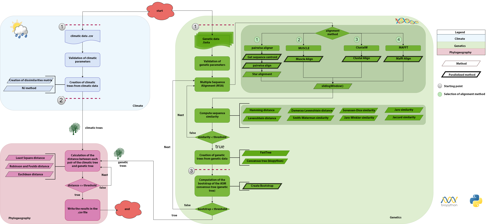

# Abstract
*aPhyloGeo* is a Python library that explores the relationship between species evolution and environmental pressures, particularly climate. By integrating genetic and climatic data, it helps researchers investigate evolutionary adaptations and identify genetic regions influenced by environmental factors.

The core feature of the software is a comprehensive phylogenetic analysis pipeline with three investigation levels: 1) genetic relationships, 2) climatic impact assessment, and 3) biogeographic correlations. This approach facilitates understanding how species adapt to their environments. 

*aPhyloGeo* employs algorithms using metrics like least squares [@felsenstein1997alternating], Euclidean, and Robinson-Foulds [@robinson1981comparison] distances to ensure statistically sound correlations. Its modular structure offers flexibility, and its open-source nature promotes collaboration.

Available as a PyPI package, *aPhyloGeo* enhances understanding of evolutionary processes and informs conservation efforts, helping prioritize species and populations for preservation in the face of climate change.

# Statement of Need

Phylogeography, the study of the interplay between evolution and environment, has long been hindered by the challenges of integrating complex phylogenetic and environmental datasets. aPhyloGeo contributes to this field by offering a user-friendly Python package that streamlines phylogeographic analysis. 
By facilitating the investigation of the intricate relationship between genetic variation and environmental factors, aPhyloGeo is poised to advance our understanding of evolution, biogeography, and conservation efforts. This powerful package makes phylogeographic analysis more accessible and efficient, opening new avenues for research and discovery.
The aPhyloGeo package is designed for versatile integration, offering flexibility to be incorporated into various environments. It can be seamlessly embedded within Python scripts for custom workflows, deployed on cloud platforms for scalable analysis, or integrated into web and desktop applications for user-friendly access. This adaptability makes it a valuable tool for diverse research and development needs, from individual projects to large-scale applications.

# Related Software Packages

While BEAST [@drummond2007beast] and MrBayes [@ronquist2012mrbayes] are popular for phylogenetic analyses, they lack integrated tools for analyzing climatic data. Other software like ArcGIS [@scott2009spatial] focuses on geospatial analysis but may not be tailored for phylogeographic research. aPhyloGeo bridges this gap by providing a unified platform for both types of analysis, with a streamlined workflow.

## aPhyloGeo: A Software Solution

*aPhyloGeo* is a software package designed for detailed phylogeographic analysis, considering both genetic and climatic data.

## Addressing Critical Questions

Given the urgency of climate change, new bioinformatics tools are needed. *aPhyloGeo* will help researchers address critical questions like:

* How has past climate shaped current genetic diversity and distribution?
* How will species distributions evolve under future climates?
* Which populations are most vulnerable to extinction?
* Are there genetic signatures of local adaptation?

## Contribution and Impact

*aPhyloGeo* aims to provide robust tools for analyzing and interpreting phylogeographic data. *aPhyloGeo* will help unravel the complex interplay between genetics, geography, and environment, informing conservation strategies and predicting impacts of climate change.

# Pipeline

\autoref{fig:figure1} outlines the key steps for conducting phylogeographic analysis using *aPhyloGeo*.
For a more detailed understanding, please refer to the [comprehensive tutorial](https://github.com/tahiri-lab/aPhyloGeo/wiki/Tutorial) and [provided with the software](https://github.com/tahiri-lab/aPhyloGeo/wiki/Worflow).

## Multiprocessing

The algorithm supports multiprocessing, allowing the simultaneous analysis of multiple sliding windows (i.e., corresponds to the alignment sub-sequence where the starting point is located after the first position of the alignment, and the ending point is located before the last position of the alignment) within genetic data. This feature is particularly recommended for large datasets, as it significantly speeds up the analysis by dividing the input sequences into smaller chunks that can be processed in parallel.

## Dependencies

This work relies on the following main software packages (refer to [pyproject.toml file](https://github.com/tahiri-lab/aPhyloGeo/blob/0889da4f2858320484db324e627e20b198703e5d/pyproject.toml)):

- [ete3](https://pypi.org/project/ete3/) [@huerta2016ete].
- [Bio](https://pypi.org/project/bio/) [@cock2009biopython].

# Methods
The methods validate input parameters to ensure data accuracy and prevent errors (refer to the [YAML file]([../aphylogeo/params.yaml](https://github.com/tahiri-lab/aPhyloGeo/blob/0889da4f2858320484db324e627e20b198703e5d/aphylogeo/params.yaml))).

## Tree Comparison

In the comparison of phylogenetic trees, which are constructed based on genetic data, with climatic trees, a crucial step involves applying a phylogeography approach. This includes the utilization of Robinson and Foulds distance for topology evaluation and Least Squares distance for assessing branch length differences.

## Editing Multiple Sequence Alignment Methods

Multiple Sequence Alignment (MSA) holds immense significance in bioinformatics as it serves as a foundational step for the comparison and analysis of biological sequences. Here is an in-depth overview of some widely used MSA methods: 1) **Pairwise Alignment** [@li2018minimap2], 2) **MUSCLE** [@edgar2004muscle], 3) **CLUSTALW** [@hung2016sequence], and **MAFFT** [@katoh2013mafft].

## Similarity Methods

Sequences with notable variability were specifically retained for analysis. The dissimilarity assessment between each sequence pair involved the application of an extensive set of 8 metrics: 1) **Hamming distance** [@labib2019hamming], 2) **Levenshtein distance** [@yujian2007normalized], 3) **Damerau-Levenshtein distance** [@zhao2019string], 4) **Jaro similarity** [@pradhan2015review], 5) **Jaro-Winkler similarity** [@pradhan2015review], 6) **Smith–Waterman similarity** [@waterman1978similarity], 7) **Jaccard similarity** [@bag2019efficient], and 8) **Sørensen-Dice similarity** [@li2020generic].

# Conclusion

The \textit{aPhyloGeo} pipeline provides an integrative framework for advanced co-analysis of genetic and climatic data, promoting simplicity and reproducibility. Future enhancements include clustering techniques and improved alignment methods, alongside novel metrics like quartet and bipartition distances for better genetic diversity assessment. Emphasizing software development best practices and open-source principles (e.g., [iPhyloGeo++](https://github.com/tahiri-lab/iPhyloGeo_plus_plus)), \textit{aPhyloGeo} ensures reliability and sets the stage for ongoing innovation. By prioritizing user empowerment and comprehensive analysis, it aims to advance phylogeographic research and deepen our understanding of species-environment interactions.

# Acknowledgements

This work was supported by the Natural Sciences and Engineering Research Council of Canada and Fonds de recherche du Québec – Nature et technologies. The computations were performed on resources provided by Compute Canada and Compute Quebec, the national and provincial infrastructure for high-performance computing and data storage. The authors would like to thank the students of the University of Sherbrooke and the Université du Québec à Montréal for their significant contributions to the development of the software. Finally, the authors would like to thank the reviewers and the editor for their valuable comments.

# References
