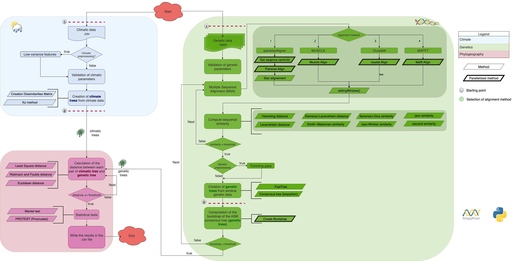

# Summary
The cross-platform application for phylogenetic tree analysis with climate parameters, *aPhyloGeo*, is a robust pipeline designed for comprehensive phylogenetic analyses using genetic and climate data. This Python API, available on [PyPI](https://pypi.org/project/aphylogeo/), offers a suite of analyses tailored to various scenarios, enabling the examination of datasets at three distinct levels: 1) genetic, 2) climatic, and 3) biogeography correlation, all within a unified package. Similarity at these levels, evaluated through metrics such as least squares distance, Euclidean distance, and Robinson-Foulds distance, significantly influences the assumptions guiding the identification of correlations between a genetic of species and its habitat during the reconstruction of the multiple alignment necessary for phylogenetic inference.

By utilizing the *aPhyloGeo* Python API, users can programmatically implement sophisticated phylogenetic analyses without the need for a graphical interface. This API provides a powerful and flexible toolset for conducting analyses, allowing users to tailor the application to their specific research needs. Through this approach, *aPhyloGeo* facilitates a nuanced understanding of the interplay between genetic evolution and environmental factors in the context of species adaptation, all within the Python programming environment.

By selecting an appropriate gene list for the available data defined on a set of species to explain the adaptation of the species according to the Darwinian hypothesis, the user can be confident that these assumptions are taken into account in *aPhyloGeo*.

# Statement of Need

The rapid impacts of climate change and anthropogenic variables on biodiversity and population dynamics underscore the necessity for more advanced tools capable of resolving the complexities of ecosystems under perturbation. Biologists utilize phylogeographic approaches to closely examine the interplay between the genetic structures of study populations and their geographic distributions, considering both current and historical geoclimatic contexts.

This software package is dedicated to advancing state-of-the-art bioinformatics tools specifically designed for detailed phylogeographic analysis. Given the urgency of the current climate crisis and the anticipated future challenges, there is a pressing need to develop tools that not only meet but also exceed bioinformatics software development standards. These tools will be crafted to enable accurate characterization of genetic diversity and phenotypic traits in strict accordance with environmental conditions. By maintaining the highest standards, this research aims to make a significant contribution to our understanding of the evolving ecological landscape and provide the scientific community with robust tools for comprehensive analysis and interpretation.

# State of the Field - Advancements in Genomic Analysis

In 2021, the Tahiri lab team introduced an algorithm aimed at identifying sub-sequences within genes, enhancing the topological similarity between reference trees (constructed from gene sequences) and phylogenetic trees (derived from genome sequences) [@nadia_tahiri-proc-scipy-2022]. This algorithm proves instrumental in pinpointing genes or gene segments sensitive or favorable to specific environments.

Subsequently, the team extended their research, applying the algorithm to SARS-CoV-2 data in 2023 [@nadia_tahiri-proc-scipy-2023]. These developments contribute significantly to the methodological landscape, shedding light on genetic factors influencing adaptability in diverse environments. The ongoing dedication to refining tools and methodologies by the Tahiri lab ensures continuous progress and elevates the overall quality of genomic analysis within the scientific community.

# Pipeline

Navigating the *aPhyloGeo* workflow (refer to \autoref{fig:figure1}) is indispensable to fully harness the potential of this bioinformatics pipeline. The visual representation in \autoref{fig:figure1} outlines the key steps for conducting phylogeographic analysis with optimal effectiveness.

The diagram below illustrates the workflow of the algorithm, consisting of several key blocks, each highlighted with a distinct color.

- **First Block (Light Blue):** This block is responsible for creating trees based on climate data and performs input parameter validation (refer to the YAML file).

- **Second Block (Light Green):** This block focuses on creating trees based on genetic data and conducts input parameter validation (refer to the YAML file).

- **Third Block (Light Pink):** The third block facilitates the comparison between phylogenetic trees (genetic data) and climatic trees, denoted as the phylogeography step. It utilizes the Robison and Foulds distance or Least Square distance.

This third block is pivotal to the study, forming the basis from which users obtain output data with essential calculations. Our approach is optimal, adapting to various computing environments through elasticity and utilizing parallelism and available GPUs/CPUs based on resource usage per unit of computation. This flexibility enables efficient processing of a single genetic window, as outlined in the workflow below.

## Multiprocessing

The algorithm supports multiprocessing, allowing simultaneous analysis of multiple windows. This feature is particularly recommended for large datasets.

## Dependencies

This work relies on the following main software packages:

- [ete3](https://pypi.org/project/ete3/) version 3.1.3 (GNU General Public License (GPL) (GPLv3))
- [Bio](https://pypi.org/project/bio/) version 1.5.9 (New BSD License)
- [robinson-foulds](https://pypi.org/project/robinson-foulds/) version 1.2 (GNU General Public License v3 (GPLv3))
- [dendropy](https://pypi.org/project/DendroPy/) version 4.6.1 (BSD License (BSD))

# Methods

## Tree Comparison

In the comparison of phylogenetic trees, which are constructed based on genetic data, with climatic trees, a crucial step involves applying a phylogeography approach. This includes the utilization of Robinson and Foulds distance for topology evaluation and Least Squares distance for assessing branch length differences.

## Editing Multiple Sequence Alignment Methods

Multiple Sequence Alignment (MSA) holds immense significance in bioinformatics as it serves as a foundational step for the comparison and analysis of biological sequences. Here is an in-depth overview of some widely used MSA methods:

- **Pairwise Alignment**: Fundamental in comparing two sequences.
- **MUSCLE**: Multiple Sequence Comparison by Log-Expectation, a popular tool for high-quality MSA.
- **CLUSTALW**: A widely-used software for multiple sequence alignment.
- **MAFFT**: Multiple Alignment using Fast Fourier Transform, known for its accuracy and efficiency.

## Similarity Methods

To enhance the algorithm's performance, a meticulous approach was adopted. Sequences with notable variability were specifically retained for analysis. The dissimilarity assessment between each sequence pair involved the application of an extensive set of 8 metrics:

1. **Hamming distance**: Measures the difference between two strings of equal length.
2. **Levenshtein distance**: Evaluates the minimum number of single-character edits required to transform one sequence into another.
3. **Damerau-Levenshtein distance**: Similar to Levenshtein distance, with an additional operation allowing transpositions of adjacent characters.
4. **Jaro similarity**: Computes the similarity between two strings, considering the number of matching characters and transpositions.
5. **Jaro-Winkler similarity**: An enhancement of Jaro similarity, giving more weight to common prefixes.
6. **Smith–Waterman similarity**: Utilizes local sequence alignment to identify similar regions within sequences.
7. **Jaccard similarity**: Measures the similarity between finite sample sets.
8. **Sørensen-Dice similarity**: Particularly useful for comparing the similarity of two samples.

This comprehensive methodology ensures a nuanced and high-quality analysis, contributing to a deeper understanding of sequence distinctions.

# Conclusion

The *aPhyloGeo* pipeline serves as an integrative framework, bringing together a variety of advanced analytical methodologies for diverse datasets, covering both genetic and climatic aspects. By consolidating these analyses within a unified platform, users can simplify their exploration of different tools while ensuring greater reproducibility in research outcomes.

Looking ahead, *aPhyloGeo* aims to integrate new functionalities, including clustering techniques based on similarity derived from multiple sequence alignments and a more computationally efficient alignment methodology. The incorporation of novel metrics, such as the Quartet metric and bipartition, aims to provide users with improved insight for making nuanced decisions regarding their datasets through a comprehensive assessment of genetic diversity.

Adhering strictly to high standards in software development, this research not only seeks to provide immediate solutions but also aims to position *aPhyloGeo* as a reliable and adaptable platform. Striving to contribute meaningfully to the field of phylogeographic analysis, the pipeline is committed to offering users a sophisticated suite of tools that seamlessly adapt to the evolving landscape of genetic research. Through these improvements, the pipeline aims to make a valuable and enduring contribution to the scientific community, enhancing the standards of reproducibility and usability.

# Acknowledgements

This work was supported by the Natural Sciences and Engineering Research Council of Canada, Fonds de recherche du Québec - Nature et technologie, the University of Sherbrooke grant, and the Centre de recherche en écologie de l'UdeS (CREUS). The author would like to thank the Department of Computer Science, University of Sherbrooke, Quebec, Canada for providing the necessary resources to conduct this research. The computations were performed on resources provided by Compute Canada and Compute Quebec - the National and Provincial Infrastructure for High-Performance Computing and Data Storage. The author would like to thank the students of the University of Sherbrooke and the Université du Québec à Montréal for their great contribution to the development of the software.

# References
